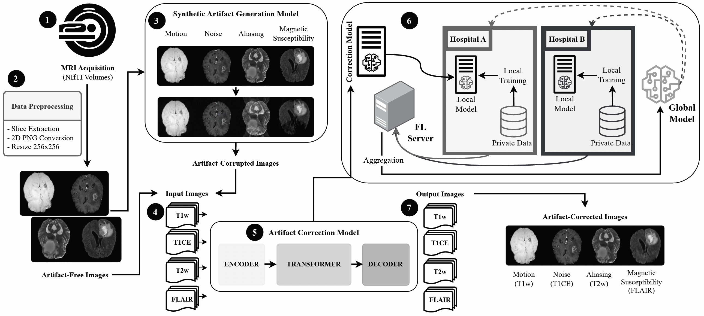
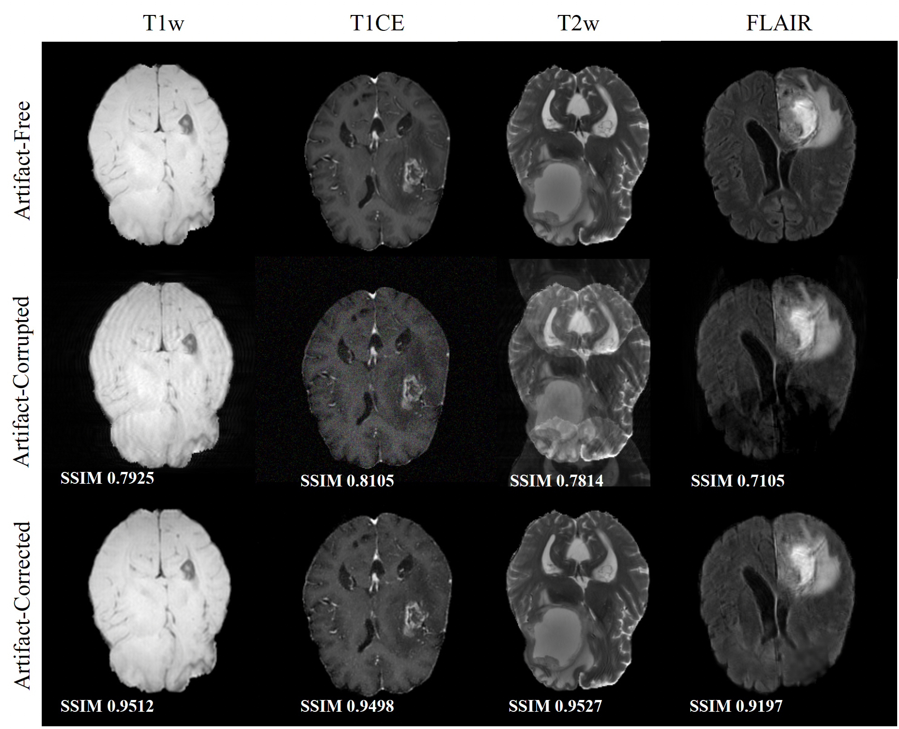
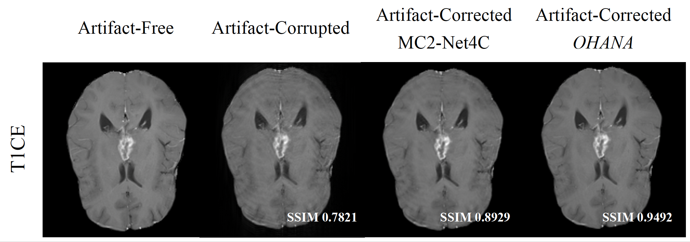

# OHANA: Optimizing Heterogeneous Multi-Artifact Correction in Neuroimaging Analysis

**OHANA** is an end-to-end framework for synthetic artifact generation and correction in multi-contrast brain MRI. It addresses two core challenges in clinical practice: the limited availability of artifact-corrupted MRI data, and the impossibility of centralizing medical data across institutions due to privacy and regulatory constraints.

OHANA integrates a **synthetic artifact generation model** and an **artifact correction model** within a **Federated Learning (FL)** environment, enabling collaborative training across multiple institutions without sharing patient data. The framework is designed to run on High Performance Computing (HPC) systems, leveraging parallel processing for scalability.

OHANA is the first solution that simultaneously:
- Provides synthetic generation of multiple MRI artifact types (motion, aliasing, magnetic susceptibility, and noise)
- Performs artifact correction across four MRI contrasts (T1w, T1CE, T2w, FLAIR)
- Enables collaborative training via Federated Learning (FedProx)

---

## Pipeline



The pipeline starts with MRI acquisition in NIfTI format **(1)**. Volumes are preprocessed into 2D PNG slices at 256×256 pixels **(2)**. The synthetic artifact generation model simulates four artifact types **(3)**, producing corrupted–clean image pairs used as input **(4)** to the artifact correction model **(5)**. Training is performed collaboratively across clients (e.g., hospitals) via an FL server **(6)**, which aggregates local model updates into a global model. The trained model is then applied to produce artifact-corrected images suitable for medical analysis **(7)**.

---

## Artifact Correction Results

The figure below shows the effectiveness of OHANA's correction model across all four MRI contrasts (T1w, T1CE, T2w, FLAIR), comparing artifact-free, artifact-corrupted, and artifact-corrected images using the 8-client collaborative setup.



The following figure compares OHANA against the MC2-Net4C baseline on T1CE contrast, illustrating OHANA's superior restoration of anatomical structures.



---

## Performance

OHANA outperforms state-of-the-art artifact correction approaches:

| Model | T1w | T1CE | T2w | FLAIR |
|---|---|---|---|---|
| CGAN | - | - | 0.8192 | - |
| MC-Net | - | - | 0.8325 | - |
| MC2-Net | 0.9508 | - | 0.8424 | 0.9434 |
| MC2-Net4C | 0.9573 | 0.8888 | 0.8034 | 0.8222 |
| **OHANA** | **0.9785** | **0.9580** | **0.9418** | **0.9526** |

SSIM scores in the collaborative setup improve with the number of clients:

| Clients | T1w | T1CE | T2w | FLAIR |
|---|---|---|---|---|
| 2 | 0.9821 | 0.9611 | 0.9576 | 0.9616 |
| 4 | 0.9843 | 0.9627 | 0.9585 | 0.9657 |
| **8** | **0.9858** | **0.9697** | **0.9666** | **0.9673** |

Overall, OHANA achieves a **17.2% improvement in SSIM** compared to MC2-Net4C on T2w contrast.

---

## Dataset

OHANA was trained and evaluated on the **BraTS2021** dataset [1, 2, 3], containing preprocessed brain MRI scans from 1,248 subjects, each with four contrasts: T1w, T2w, FLAIR, and T1CE. A total of 94,848 artifact-free 2D axial images were extracted (23,712 per contrast), split 75/15/10 for training, validation, and testing.

> Data used in this publication were obtained as part of the RSNA-ASNR-MICCAI Brain Tumor Segmentation (BraTS) Challenge project through Synapse ID (syn25829067).

**References:**

[1] U. Baid et al., "The RSNA-ASNR-MICCAI BraTS 2021 benchmark on brain tumor segmentation and radiogenomic classification," arXiv:2107.02314, 2021.

[2] B. H. Menze et al., "The multimodal brain tumor image segmentation benchmark (BRATS)," IEEE Transactions on Medical Imaging, vol. 34, no. 10, pp. 1993–2024, 2014.

[3] S. Bakas et al., "Advancing the cancer genome atlas glioma MRI collections with expert segmentation labels and radiomic features," Scientific Data, vol. 4, no. 1, pp. 1–13, 2017.

---

## Methodology

### Data Preprocessing

Brain volumes in NIfTI format are converted to 2D PNG slices and resized to 256×256 pixels.

### Synthetic Artifact Generation Model

Simulates four artifact types to produce paired corrupted–clean images for training:

- **Motion** — random rotations and translations applied in the Fourier domain, mimicking ghosting and blurring distortions.
- **Aliasing** — a vertically shifted copy of the image is blended with the original using a configurable blend factor.
- **Magnetic Susceptibility** — spatially varying displacement fields deform the image, reproducing geometric warping from magnetic field inhomogeneities.
- **Noise** — zero-mean Gaussian noise is superimposed on the image, with standard deviation controlling intensity.

### Artifact Correction Model

Based on an extended **MC2-Net** architecture, adapted for four MRI contrasts. Key changes include four-channel input/output layers, doubled convolutional filters (16→32), Group Normalization, and batch size of 4. The model follows an Encoder–Transformer–Decoder structure with perceptual loss (VGG-16) and Adam optimizer (lr=0.001).

### Federated Learning

OHANA uses **NVFlare** with the **FedProx** algorithm. Each client trains locally and shares only model updates with the FL server. No patient data leaves the institution. SSIM improves consistently as more clients participate, benefiting from broader data distributions.

---

## Directory Structure

```
├── data-processing/         # Preprocessing scripts (format conversion, resizing, slice selection)
├── simulation-model/        # Artifact simulation (motion, aliasing, susceptibility, noise)
├── ohana-fl-fedprox/        # FL experiments using the FedProx algorithm
│   ├── app/
│   │   ├── config/
│   │   │   ├── config_fed_client.json
│   │   │   └── config_fed_server.json
│   │   └── custom/
│   │       ├── dataset.py
│   │       ├── fed_learner.py
│   │       ├── model_persistor.py
│   │       ├── model.py
│   │       └── utils.py
│   ├── workspaces/
│   │   ├── add_clients.py
│   │   ├── project_original.yml
│   │   └── project.yml
│   ├── meta.json
│   ├── requirements.txt
│   ├── start_fl_admin.sh
│   ├── start_fl_secure_clients.sh
│   ├── start_fl_secure_mlflow.sh
│   ├── start_fl_secure_server.sh
│   ├── submit_job.py
│   └── submit_job.sh
```

---

## Usage

```bash
# Data processing
sbatch dataprocessing.sh

# Simulate artifacts L1
sbatch simulation_l1.sh

# Simulate artifacts L2
sbatch simulation.sh

# Artifact correction
# Install dependencies (run in a virtual environment)
pip install -r requirements.txt

# Start MLflow tracking
sbatch start_fl_secure_mlflow.sh

# Start the FL server
sbatch start_fl_secure_server.sh

# Start the FL clients
sbatch start_fl_secure_clients.sh

# Submit a FL job
sbatch submit_job.py
```

---

## Citation

If you use OHANA in your research, please cite:

```
Alícia Oliveira, Beatriz Cepa, António Sousa, Cláudia Brito.
"OHANA: Optimizing Heterogeneous Multi-Artifact Correction in Neuroimaging Analysis."
HASLab, INESC TEC / University of Minho, 2026.
```

---

## Contact

For more information, please contact:
- alicia.oliveira@inesctec.pt
- claudia.v.brito@inesctec.pt